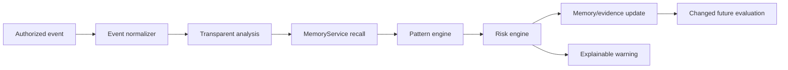

# HandoffOS

> **The AI That Inherits Human Knowledge.**
>
> *From individual expertise to organizational intelligence.*

HandoffOS is a full-stack organizational memory and knowledge-safety platform built around a fictional payments company, **FinPay**. It does not wait for a user to ask a chatbot a question. Instead, it processes **authorized project activity**, preserves the evidence behind what the organization learned, recognizes repeat patterns, and generates an explainable warning when historical knowledge becomes relevant to a new action.

## The problem

When an experienced employee leaves, a company may retain source code, tickets, and documents while losing the reasoning that made a system safe to operate:

- hidden dependencies and client-specific exceptions;
- undocumented deployment checks and expert workflows;
- failed approaches and the reasons they failed;
- context behind historical incidents; and
- rules whose meaning shifted over time.

This is especially risky when a new owner makes a change that resembles a prior failure but cannot know which historical evidence matters.

## The HandoffOS approach

HandoffOS turns individual expertise into operational organizational intelligence.



The MVP's analysis is intentionally **deterministic and evidence-based**, so it is inspectable and repeatable during a demo. The architecture contains a server-only adapter boundary for a future external LLM or persistent-memory provider, but no external provider is claimed or mocked.

## What is implemented

### Full-stack foundations

- React + TypeScript + Vite application workspace
- Express server and same-origin REST API
- Drizzle ORM with a managed MySQL-compatible database
- Manus OAuth session flow with protected application routes and APIs
- Secure logout/profile session behavior; no browser-exposed database or OAuth secrets
- Typed Zod request validation, API error states, loading states, and private/no-store authenticated responses
- Persistent application state: events, memories, evidence, patterns, gaps, conflicts, warnings, settings, handoff sessions, and reasoning-test results

### Organizational intelligence capabilities

- **Live Activity** — persisted authorized event feed with AI stage and risk level
- **Organizational Memory** — search, filters, sorting, memory detail, historical context, and evidence
- **Knowledge Shadow** — repeated, undocumented expert behavior with real document/investigate/dismiss state changes
- **Unknown Knowledge** — unexplained recurring behavior with persistent follow-up actions
- **Failure Fingerprints** — recurring incident combinations with linked historical incidents
- **Proactive Warning Center** — evidence-backed warning generation, status updates, and “Why am I seeing this?” evidence panel
- **Knowledge Conflicts** — preserves historical claims while identifying newer supported interpretations
- **Knowledge Timeline** — visible history, current state, incidents, evidence, and mutation events
- **Knowledge Graph** — interactive relationship explorer for people, systems, memories, and incidents
- **Handoff Simulator** — Maya’s transfer risk, critical knowledge list, simulated departure, and backend-evaluated reasoning test
- **Settings** — persistent agent status, authorization-scoped sources, notification level, memory status, and retention preference

## Demo story

The seeded FinPay environment includes:

- **Maya**, Senior Backend Engineer; **Arjun**, Backend Engineer; and Leah, Site Reliability Engineer
- Payment API, Legacy Authentication, Customer Identity, Billing Service, and Notification Service
- 24 historical memories, 8 incidents, 8 knowledge patterns (including 5 undocumented patterns), 5 knowledge gaps, 3 conflicts, and 3 failure fingerprints
- incidents **#101, #142, and #184** for Legacy Authentication changes causing enterprise/customer login failures
- Maya’s repeated, undocumented check of Customer Identity before Payment API deployments
- historical Client ABC Legacy Auth context, OAuth documentation and production telemetry, and a preserved conflict record

### Killer workflow

Open **Overview** and use the three-step **Killer workflow** panel:

1. **Analyze proposed change** — Arjun creates a real `PR_CREATED` event: `Remove legacy authentication service.`
   - The backend persists the event, recalls the stored FinPay memories and incidents, matches Failure Fingerprint #17, and creates a critical persisted warning.
2. **Supply new evidence** — Arjun submits a real `DOCUMENT_UPDATED` event: `Client ABC completed migration to OAuth.`
   - The backend persists a distinct verified evidence record and current memory, resolves the conflict's current interpretation, preserves Maya’s historical claim and incident context, and mitigates active critical warnings.
3. **Retry with context** — the same proposed action now runs against the changed evidence set.
   - The fingerprint remains historically relevant, but the current result changes to a lower-severity suggestion with a rollback/telemetry recommendation.

Then open **Handoff Simulator**, create Maya’s assessment, simulate her departure, and answer the expert-reasoning scenario. HandoffOS evaluates the answer on the server against its stored checklist and returns transferred/missed reasoning plus a knowledge-transfer score.

## Data model

| Table | Purpose |
|---|---|
| `users` | Manus OAuth identities and application roles |
| `employees`, `projects` | FinPay people and owned systems/components |
| `events` | Normalized authorized project activity and processing result |
| `memories` | Durable decisions, incidents, dependencies, workarounds, failures, evidence, and context |
| `incidents`, `evidence` | Historical outcomes and attributable supporting claims |
| `failureFingerprints`, `fingerprintIncidents` | Risk combinations and their evidence-linked incidents |
| `knowledgePatterns`, `knowledgeGaps` | Shadows, mutations, dead ends, and unresolved unknowns |
| `conflicts` | Historical vs current claims without historical deletion |
| `warnings` | Explainable, persisted information/suggestion/critical alerts |
| `handoffSessions`, `handoffTestResults` | Transfer assessment and expert-reasoning outcomes |
| `organizationSettings` | FinPay agent and privacy settings |

Migrations are additive and run through Drizzle. The FinPay seed is idempotent: it creates the environment only if FinPay does not yet exist and never overwrites later user edits.

## Memory architecture

`server/services/memory.ts` defines the provider-neutral `MemoryService` contract:

- `remember()`
- `recall()`
- `reflect()`
- `updateMemory()`
- `findRelatedMemories()`
- `detectConflict()`

`LocalDatabaseMemoryService` is the active implementation. It stores and retrieves real Drizzle/MySQL rows. `HANDOFFOS_MEMORY_PROVIDER` is reserved for a future explicitly configured adapter; unsupported external values log a truthful fallback to durable local memory rather than faking a third-party integration.

## Backend API

All business APIs are authenticated, validated, and served with `Cache-Control: private, no-store`. The public exception is `GET /api/health` for deployment health.

| Endpoint | Purpose |
|---|---|
| `POST`, `GET /api/events` | Persist/process or list authorized events |
| `POST /api/analyze-event` | Equivalent event analysis entrypoint |
| `POST`, `GET /api/memories` | Create and search organizational memory |
| `GET /api/memories/:publicId` | Memory detail plus direct evidence |
| `GET /api/warnings` | Warning center data |
| `GET /api/warnings/:publicId/evidence` | Explainable incident/claim evidence panel |
| `PATCH /api/warnings/:publicId` | Persist warning status |
| `GET /api/knowledge-shadow` | Repeated undocumented behavior |
| `GET /api/failure-fingerprints` | Fingerprints with historical incident links |
| `GET`, `PATCH /api/knowledge-gaps` | Unknown knowledge and real follow-up actions |
| `GET /api/conflicts` | Concurrent historical/current claims |
| `GET /api/timeline`, `GET /api/graph` | Timeline and relationship explorer |
| `GET`, `POST /api/handoff` | Handoff assessment and simulated departure |
| `POST /api/handoff/test` | Server-side expert reasoning evaluation |
| `GET`, `PUT /api/settings` | Persistent control-plane settings |

## Project structure

```text
client/
  public/                 # route manifest, HandoffOS favicon
  src/components/         # authenticated HandoffOS workspace and shared UI
  src/lib/api.ts          # typed same-origin authenticated API client
server/
  routes/api.ts           # protected REST endpoints
  services/seed.ts        # idempotent FinPay organizational data
  services/memory.ts      # local durable MemoryService implementation
  services/intelligence.ts# event → memory → pattern → risk pipeline
  services/risk.ts        # transparent changing-risk rule
  services/connectors.ts  # future connector interface/roadmap
shared/handoff.ts         # shared Zod contracts and domain enums
drizzle/schema.ts         # persistent relational data model
```

## Run locally

### Prerequisites

- Node.js 22+
- pnpm 10.18+
- a MySQL-compatible `DATABASE_URL`
- managed Manus OAuth environment variables when using the platform’s supported login flow

### Commands

```bash
pnpm install
pnpm db:push       # generate and apply the additive Drizzle migration
pnpm dev           # starts Express + Vite on PORT (3000 by default)
```

Then open the development preview. The service initializes the idempotent FinPay seed at startup. The frontend routes are declared in `client/public/manus-routes.json`.

### Environment variables

| Variable | Required | Purpose |
|---|---:|---|
| `DATABASE_URL` | Yes | Server-only MySQL-compatible database DSN |
| `MANUS_PROJECT_ID` | Managed | OAuth client identity |
| `MANUS_OAUTH_PORTAL_URL` | Managed | Manus authorization endpoint base |
| `MANUS_OAUTH_API_URL` | Managed | Server-only token/identity service base |
| `MANUS_JWT_SECRET` | Managed | Validates `webdev_app_session` |
| `HANDOFFOS_MEMORY_PROVIDER` | Optional | Future external-memory adapter selector; defaults to local durable memory |

Never add these values to frontend source or commit them to the repository.

## Demo account and access

Use the **Manus account** attached to the project to sign in. In the managed development Preview, the platform may provide a compatible Preview session; otherwise the HandoffOS login screen starts the real Manus OAuth flow. The app does not seed a fake Preview user or implement a bypass authentication mode.

## Validation

```bash
pnpm check
pnpm test
pnpm build
```

The focused `risk.test.ts` demonstrates the pivotal state transition: the same Legacy Authentication action is **critical** before a verified Client ABC OAuth completion record, then becomes a **suggestion** when the verified evidence exists. Existing platform auth tests also run through the repository test command.

## Future connector architecture

The MVP’s `SimulatedEventsConnector` establishes the event-normalization boundary. Future adapters can add authorized GitHub, Jira, Slack, Microsoft Teams, CI/CD, and documentation events without changing the memory/risk pipeline. Any real integration must first receive explicit authorization, credentials, and appropriate webhook or API capability review.

## Responsible observation

HandoffOS is designed around **authorized project data**. It does not claim unrestricted surveillance. The current MVP processes simulated events only; external sources shown in Settings are future connection options, not live integrations.
